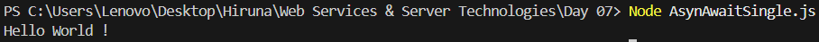
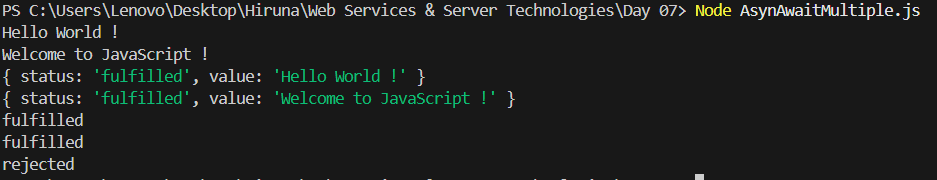
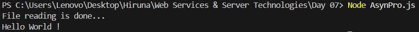
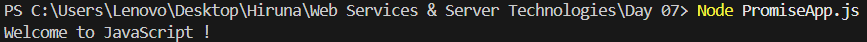

| Codes | Output |  
|-------|--------|  
|['AsynAwaitSingle.js'](./Codes/AsynAwaitSingle.js)||  
|['AsynAwaitMultiple.js'](./Codes/AsynAwaitMultiple.js)||  
|['AsynPro.js'](./Codes/AsynPro.js)||  
|['PromiseApp.js'](./Codes/PromiseApp.js)||  
