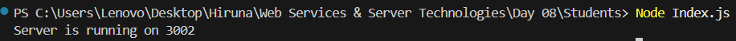
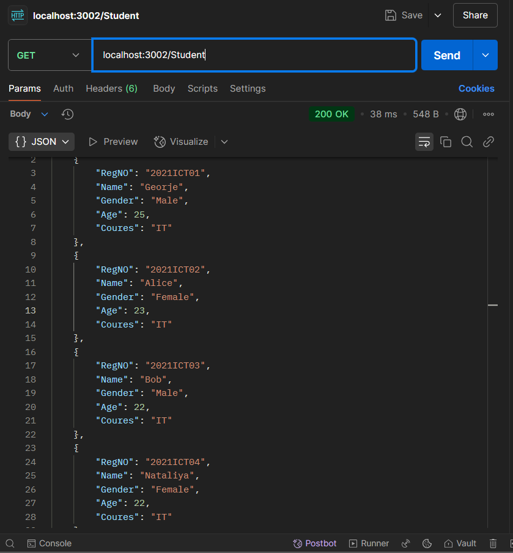
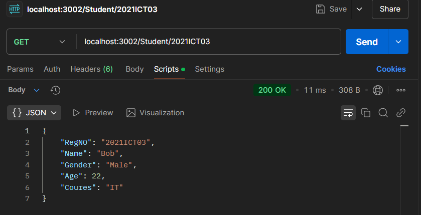
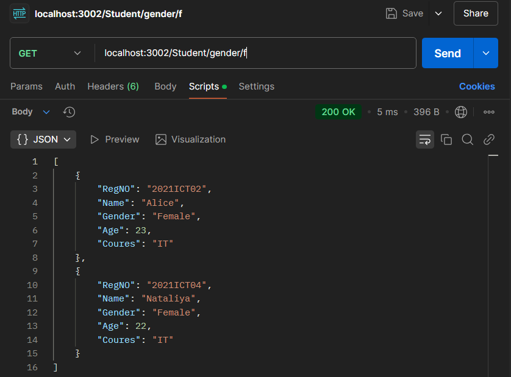

| Codes | Output |  
|-------|--------|  
|['Index.js'](./Codes/Index.js)||  
| ||  
| ||  
| ||  
|['StudentDB.js'](./Codes/StudentDB.js)| |  
|['StudentRoute.js'](./Codes/StudentRoute.js)| |  
|['StudentServices.js'](./Codes/StudentServices.js)| |  
