# --------------- 🔰MongoDB Tutorial 2🔰 -------------------

⚙️ MongoDB CRUD Operations

## 🗑️ How to drop a database
🧭 Using MongoDB Compass

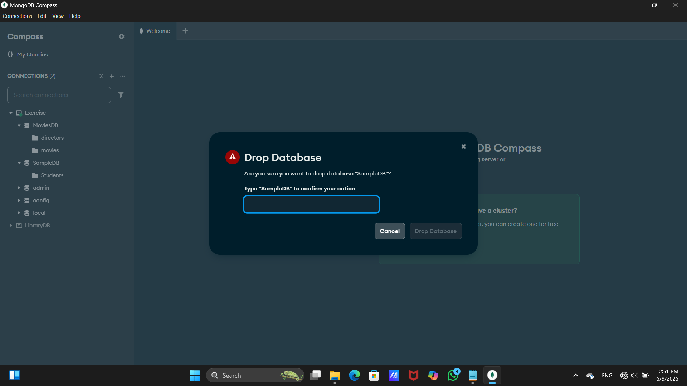

💻 Using Mongo Shell   
1.Go to the MongoDB shell.  
2.Use database that you want to drop.(use SampleDB)  
3.Query : db.dropDatabase()  
4.After that refresh your connection and make sure if your database is droped or not.  

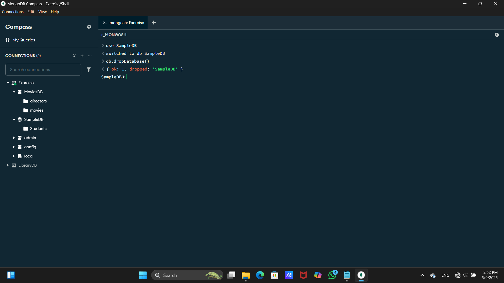

## 🗑️ How to drop a collection
🧭 Using MongoDB Compass

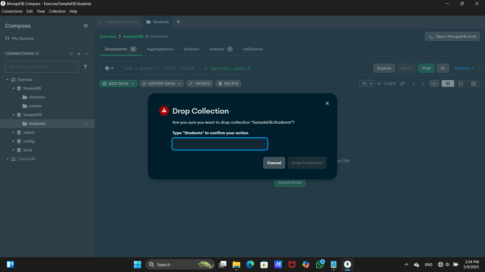

💻 Using Mongo Shell   
1.Go to the MongoDB shell.  
2.Use database that you want to drop.(use SampleDB)  
3.Query : db.SampleData.drop()  
4.After that refresh your connection and make sure if your collection is droped or not.  

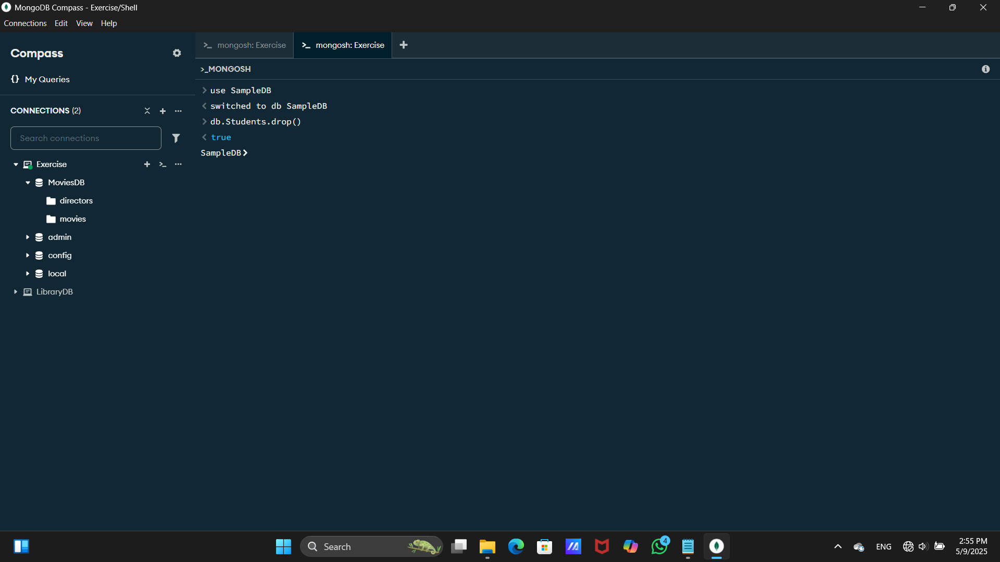

## 🗑️ How to delete a document

📝 First insert some data into your collection,

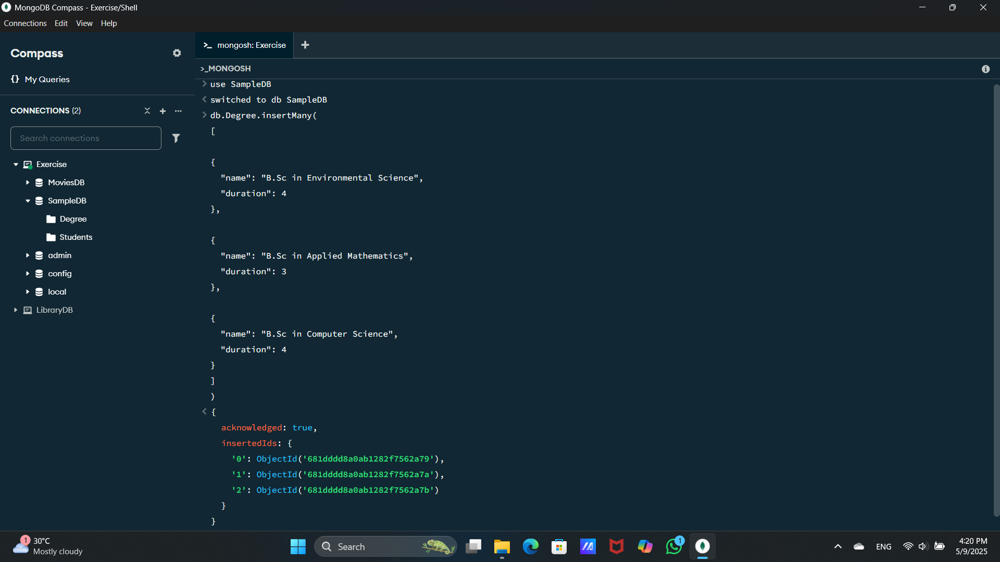

🧍‍♂️ deleteOne() – Delete a Single Record

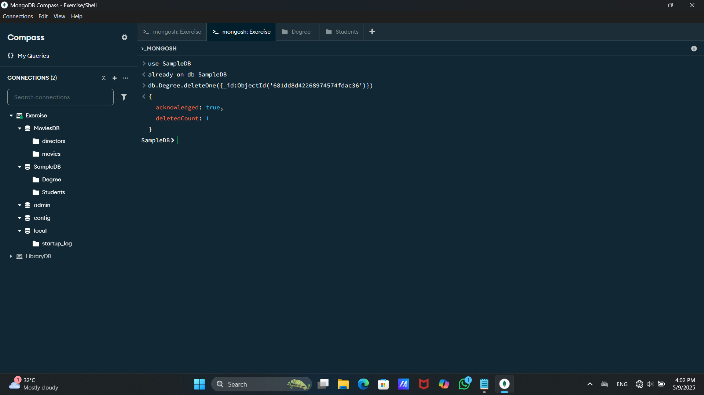

👥 deleteMany() – Delete Multiple Records

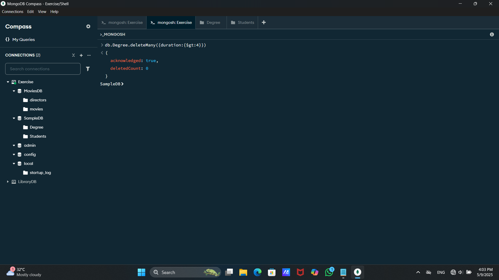

## 🔍 Displaying Data from a Collection

1️⃣First Method

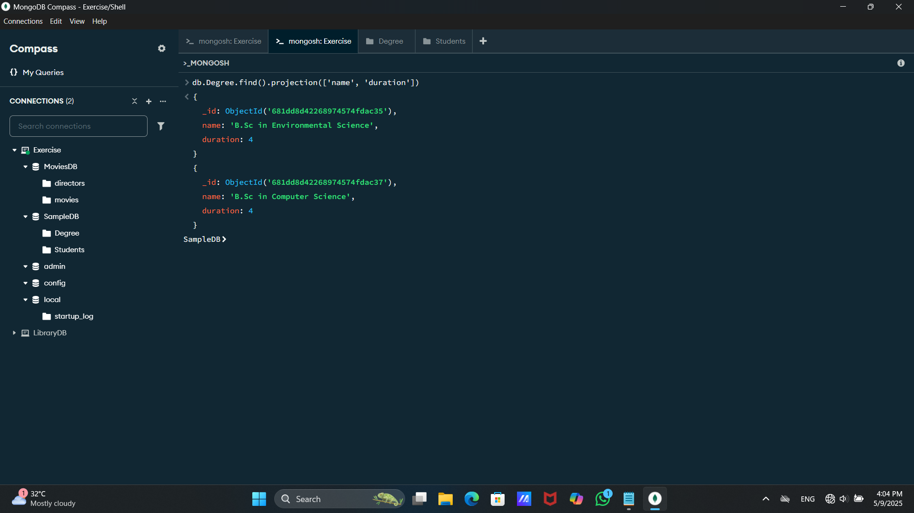

2️⃣Second Method

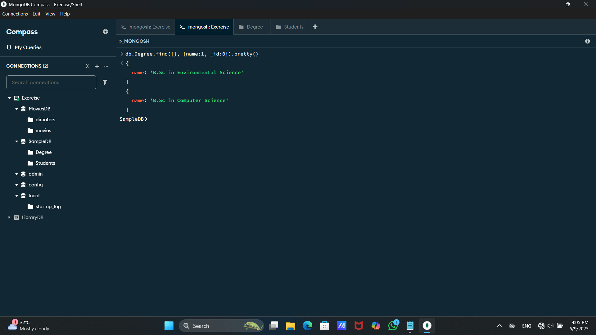

3️⃣Third Method

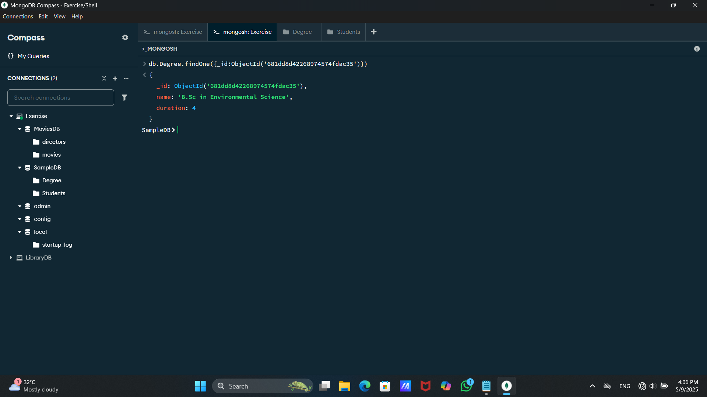

## ♻️ Updating Data in Document

1️⃣ updateOne() – Update a Single Document

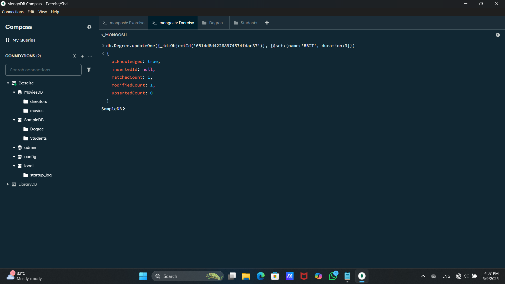

2️⃣ updateMany() – Update Multiple Documents

